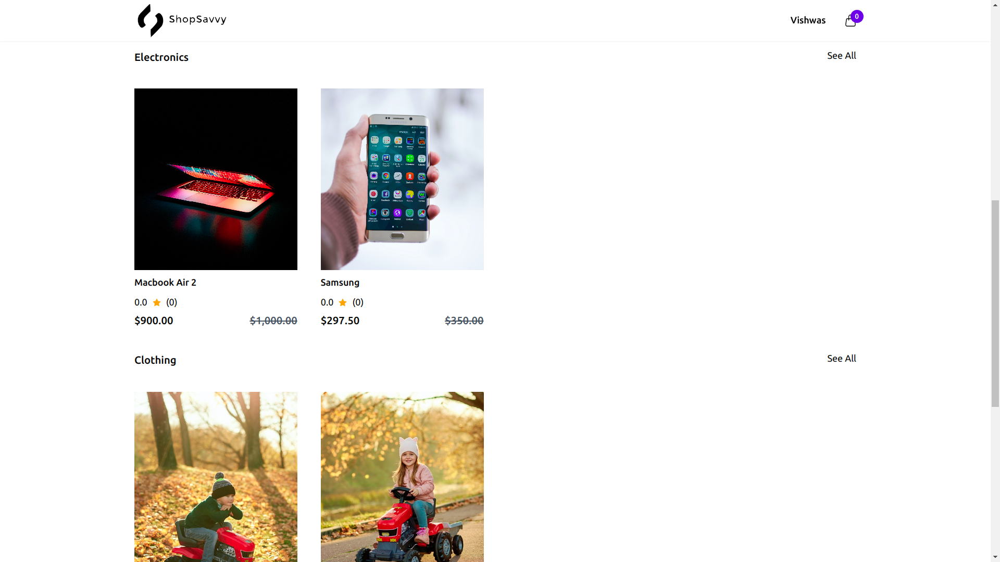

# ShopSavvy-backend
This project is an E-Commerce platform developed using the MERN stack (MongoDB, Express.js, React, Node.js). It provides a user-friendly interface for both buyers and sellers, allowing buyers to browse products, select attributes, add to cart, and make simulated payments using Stripe. Sellers can manage product categories, add products, update stock, and perform CRUD operations on their products.

## Features

- User-friendly buyer interface with product attribute selection and cart functionality.
- Simulated payment processing using Stripe for buyer checkout.
- Seller dashboard for category and product management.
- Secure user authentication and authorization.
- Responsive design for optimal viewing on various devices.

## Installation and Setup
Clone the frontend and backend repositories, cd into them individually, and then follow the below mentioned steps for setting up backend and frontend separately.

Frontend:

    - Fork the repository.
    - Clone the repository git clone https://github.com/vishwas031/shopSavvy-frontend.git
    - Open the folder in which you cloned the repository.
    - Run *npm install*
    

Backend:

    - Fork the repository.
    - Clone the repository git clone https://github.com/vishwas031/shopSavvy-backend.git
    - Open the folder in which you cloned the repository.
    - Run *npm install*
    - Create a .env file.
Create .env file in the backend and insert these values:

   ```
    PORT=BACKEND_PORT || 5000
    URL=MONGODB_URI
    JWT_SECRET=JWT_SECRET
    CLIENT=CLIENT_URL
    STRIPE_KEY=YOUR_STRIPE_PRIVATE_KEY
   ```

## Usage

1. Start the server: In the `backend`, run `npm start server`.
2. Start the client: In the `frontend` directory, run `npm start`.
3. Access the application in your browser at `http://localhost:3000`.

## Screenshots




